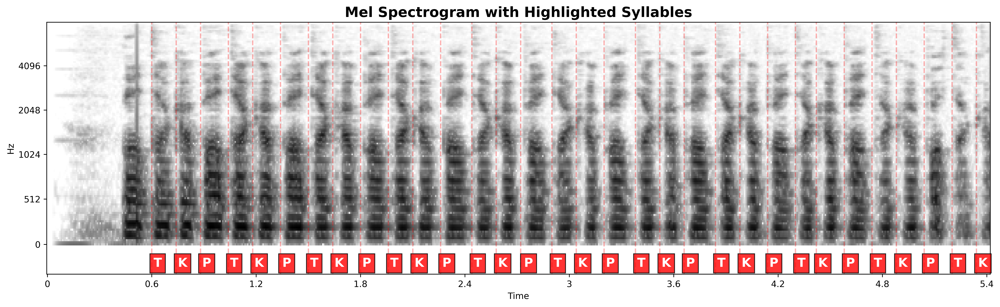
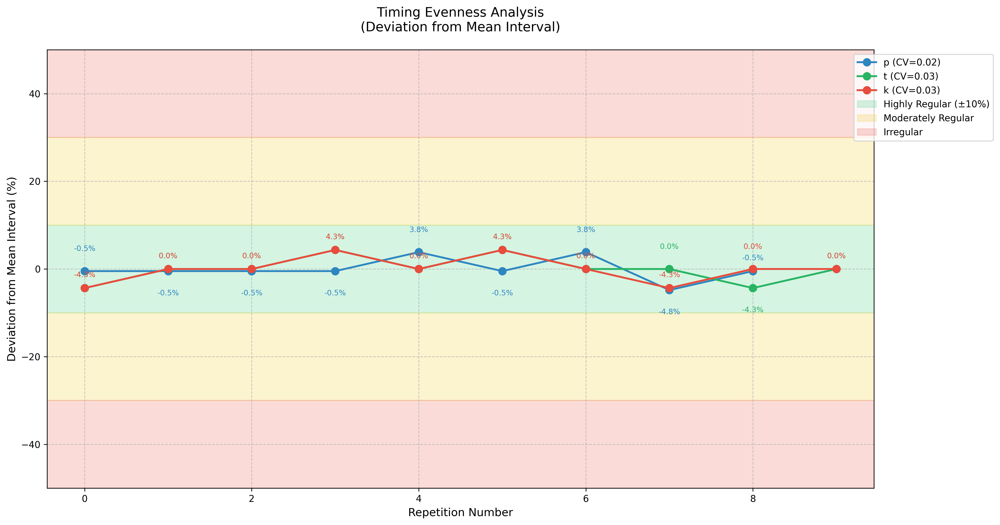
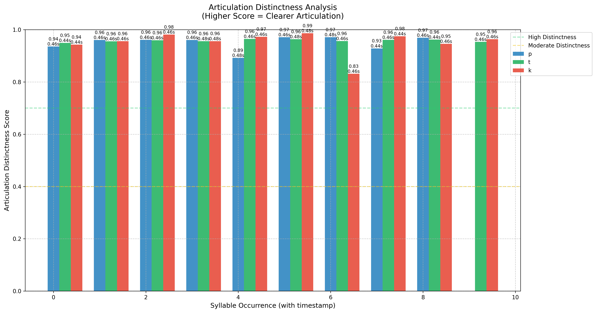
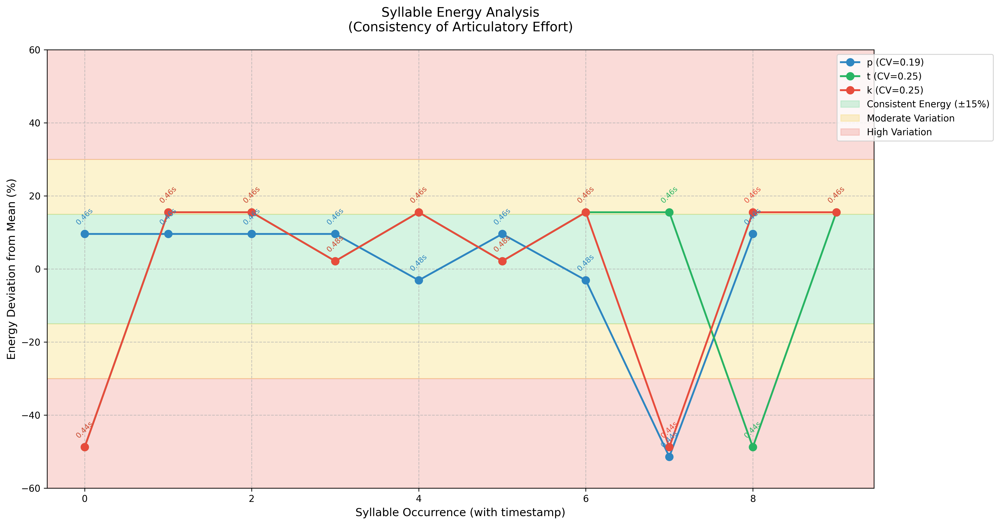
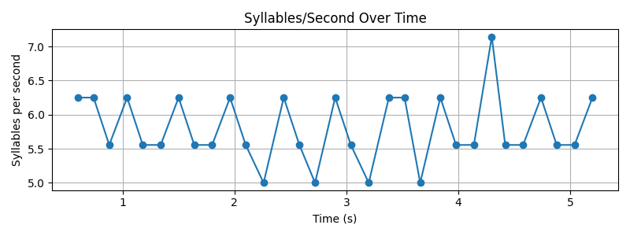
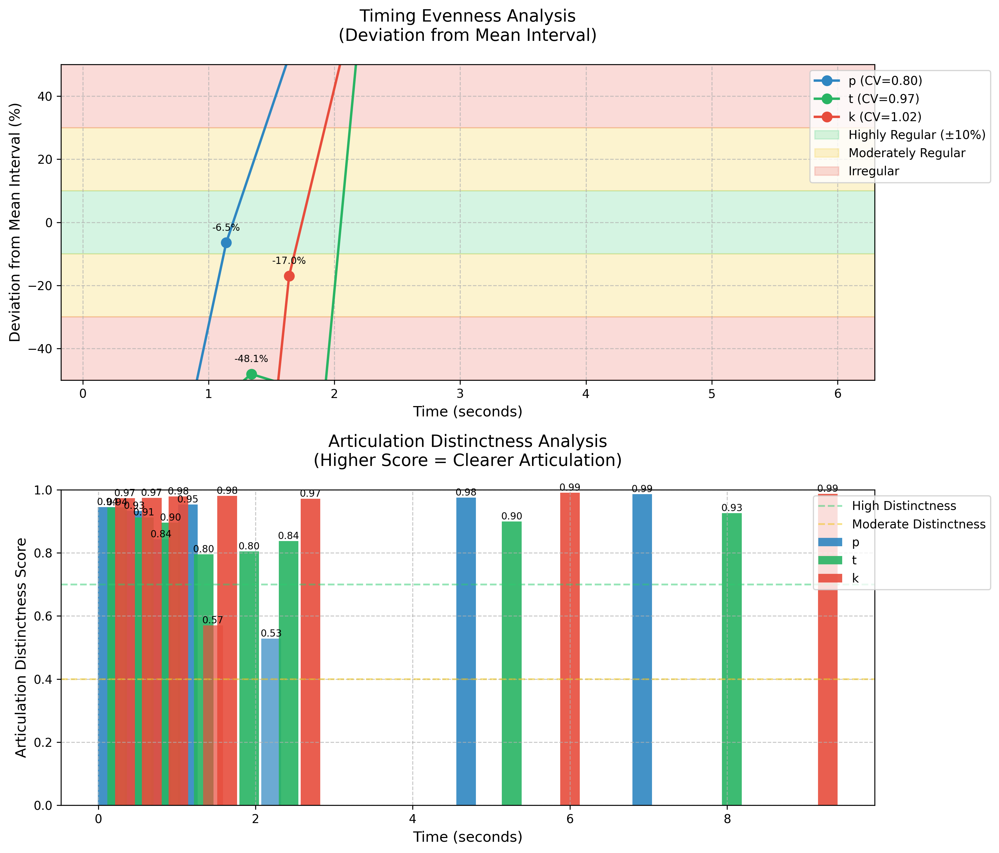

# Pataka Test - Speech Pathology Analysis Tool

## Overview

The **Pataka Test** is an advanced speech pathology analysis tool designed to assess speech motor control and articulation in individuals with speech disorders. The test focuses on the rapid repetition of the syllable sequence "pa-ta-ka" (also known as the DDK - Diadochokinetic test), which is a standard clinical assessment for evaluating speech motor planning and execution.

## What is the Pataka Test?

The Pataka test is a widely used clinical assessment in speech-language pathology that evaluates:

- **Diadochokinesis**: The ability to rapidly alternate between different articulatory movements
- **Speech Motor Control**: Coordination and timing of speech production
- **Articulation Precision**: Clarity and distinctness of consonant production
- **Speech Rate**: Speed and consistency of syllable production

### Clinical Applications

This test is particularly valuable for assessing:
- **Dysarthria**: Motor speech disorders affecting muscle control
- **Apraxia of Speech**: Difficulty planning and executing speech movements
- **Parkinson's Disease**: Speech motor control issues
- **Stroke Recovery**: Speech motor rehabilitation progress
- **Developmental Speech Disorders**: Childhood speech motor development

## Features

### 🎯 **Comprehensive Analysis**
- **Speed Analysis**: Measures syllables per second with precise timing
- **Evenness Assessment**: Evaluates timing regularity between repetitions
- **Distinctness Analysis**: Assesses articulation clarity and precision
- **Energy Analysis**: Measures articulatory effort and consistency

### 📊 **Advanced Visualizations**
- **High-Quality Mel Spectrograms**: Ultra-high resolution frequency analysis with syllable highlighting
- **Timing Evenness Plots**: Visual representation of rhythm consistency across repetitions
- **Articulation Distinctness Charts**: AI-powered confidence scores for each syllable
- **Energy Pattern Analysis**: Effort consistency and articulatory strength patterns
- **Syllables per Second Plot**: Real-time speech rate analysis over time

### 🎤 **Multiple Input Methods**
- **File Upload**: Support for WAV, MP3, and OGG audio files
- **Live Recording**: Direct microphone recording with real-time processing
- **Batch Processing**: Analyze multiple recordings efficiently

### 📈 **Detailed Metrics**
- **Syllable Count**: Total number of p, t, k syllables detected
- **Timing Metrics**: Mean intervals, standard deviation, coefficient of variation
- **Confidence Scores**: AI-powered articulation quality assessment
- **Energy Measurements**: RMS energy and spectral spread analysis

## Technical Implementation

### AI-Powered Analysis
The tool uses state-of-the-art speech recognition technology:
- **Wav2Vec2 Model**: Facebook's advanced speech recognition model
- **Character-Level Alignment**: Precise timing detection for each syllable
- **Confidence Scoring**: AI-based assessment of articulation quality

### Audio Processing Pipeline
1. **Preprocessing**: Resampling, mono conversion, noise reduction
2. **Feature Extraction**: Mel spectrogram generation with high resolution
3. **Syllable Detection**: AI-powered identification of p, t, k sounds
4. **Timing Analysis**: Precise measurement of intervals and rates
5. **Quality Assessment**: Confidence scoring and energy analysis

### High-Quality Output
- **600 DPI Visualizations**: Publication-ready figures
- **Speech-Optimized Frequency Range**: 0-8000 Hz focus
- **512 Mel Bins**: Ultra-fine frequency resolution
- **Professional Formatting**: Clinical-grade reports

## Installation

### Prerequisites
- Python 3.8 or higher
- FFmpeg (for audio processing)
- eSpeak (for phoneme processing)

### Dependencies
```bash
pip install -r requirements.txt
```

### System Requirements
- **RAM**: 4GB minimum, 8GB recommended
- **Storage**: 2GB for models and dependencies
- **CPU**: Multi-core processor recommended for faster processing

## Usage

### Web Interface
1. **Start the application**:
   ```bash
   streamlit run new_app.py
   ```

2. **Upload audio file** or **record live audio**

3. **View results**:
   - Real-time analysis metrics
   - Interactive visualizations
   - Downloadable analysis package

### Command Line Usage
```python
from new_app import get_syllables_per_second

# Analyze audio file
with open('audio.wav', 'rb') as f:
    audio_bytes = f.read()
    
result = get_syllables_per_second(audio_bytes)
print(f"Syllables per second: {result:.2f}")
```

## Analysis Visualizations

The Pataka test generates comprehensive visualizations that provide detailed insights into speech motor control. Each visualization serves a specific clinical purpose:

### 🎵 **Mel Spectrogram with Highlighted Syllables**



**Purpose**: Shows the frequency content of speech over time with precise syllable timing
- **Frequency Range**: 0-8000 Hz (speech-optimized range)
- **Resolution**: 600 DPI for clinical-grade detail
- **Syllable Markers**: Red vertical lines and labels (P, T, K) show exact timing
- **Clinical Use**: Identifies timing patterns, frequency characteristics, and syllable boundaries

### ⏱️ **Timing Evenness Analysis**



**Purpose**: Evaluates the consistency of timing between syllable repetitions
- **Y-Axis**: Deviation from mean interval (percentage)
- **Color Zones**: 
  - Green (±10%): Highly regular timing
  - Yellow (±10-30%): Moderately regular
  - Red (±30%+): Irregular timing
- **Clinical Use**: Assesses speech motor control and rhythm consistency

### 🎯 **Articulation Distinctness Analysis**



**Purpose**: Measures the clarity and precision of each syllable articulation
- **Y-Axis**: AI-powered confidence scores (0-1)
- **Bar Heights**: Higher bars indicate clearer articulation
- **Color Coding**: Blue (P), Green (T), Red (K) for easy identification
- **Clinical Use**: Identifies which syllables need articulation therapy

### ⚡ **Energy Analysis**



**Purpose**: Analyzes articulatory effort and energy consistency across repetitions
- **Y-Axis**: Energy deviation from mean (percentage)
- **Patterns**: Shows consistency of articulatory effort
- **Color Zones**: Indicates energy variation levels
- **Clinical Use**: Assesses motor control and effort consistency

### 📈 **Syllables per Second Over Time**



**Purpose**: Shows speech rate variation throughout the recording
- **X-Axis**: Time progression
- **Y-Axis**: Instantaneous speech rate
- **Markers**: Individual data points for each interval
- **Clinical Use**: Identifies rate changes, fatigue, or compensatory strategies

### 🗣️ **Articulation Analysis**



**Purpose**: Comprehensive overview of articulation quality and patterns
- **Multi-metric Display**: Combines timing, distinctness, and energy metrics
- **Clinical Overview**: Provides a complete picture of speech motor performance
- **Pattern Recognition**: Helps identify specific areas of difficulty
- **Clinical Use**: Overall assessment tool for therapy planning and progress monitoring

## Output Files

The analysis generates a comprehensive package including:

### 📊 **Visualizations**
- `mel_spectrogram.png`: High-resolution frequency analysis with syllable highlighting
- `evenness_analysis.png`: Timing consistency visualization with color-coded zones
- `distinctness_analysis.png`: AI-powered articulation quality assessment
- `energy_analysis.png`: Articulatory effort consistency patterns
- `syllables_per_second.png`: Real-time speech rate analysis

### 📄 **Reports**
- `analysis_results.txt`: Detailed numerical results and clinical interpretations
- `recorded_audio.wav`: Processed audio file for reference
- `analysis_package.zip`: Complete analysis package for download

## Clinical Interpretation

### Speed Measurements
- **Normal Range**: 4-7 syllables per second
- **Below 4/s**: Possible motor speech disorder
- **Above 7/s**: May indicate compensatory strategies

### Evenness Assessment
- **CV < 0.1**: Highly regular timing (excellent)
- **CV 0.1-0.3**: Moderately regular (good)
- **CV > 0.3**: Irregular timing (needs attention)

### Distinctness Scores
- **> 0.7**: High articulation clarity
- **0.4-0.7**: Moderate distinctness
- **< 0.4**: Low distinctness (articulation issues)

### Energy Consistency
- **CV < 0.15**: Consistent articulatory effort
- **CV 0.15-0.30**: Moderate variation
- **CV > 0.30**: High variation (motor control issues)

## Research Applications

This tool supports various research areas:
- **Clinical Trials**: Objective measurement of treatment outcomes
- **Longitudinal Studies**: Tracking speech motor development
- **Comparative Analysis**: Cross-population speech motor studies
- **Rehabilitation Monitoring**: Progress tracking in therapy

## Technical Specifications

### Audio Requirements
- **Sample Rate**: 16kHz (automatically resampled)
- **Format**: WAV, MP3, OGG
- **Duration**: 3-30 seconds recommended
- **Quality**: Clear speech, minimal background noise

### Model Specifications
- **Wav2Vec2**: facebook/wav2Vec2-xlsr-53-espeak-cv-ft
- **Frame Rate**: 20ms (50 frames per second)
- **Language**: English (espeak phoneme set)
- **Accuracy**: High precision for p, t, k detection

## Contributing

We welcome contributions to improve the Pataka test tool:
- **Bug Reports**: Report issues via GitHub issues
- **Feature Requests**: Suggest new analysis capabilities
- **Code Contributions**: Submit pull requests for improvements
- **Clinical Validation**: Help validate against clinical standards

## License

This project is licensed under the MIT License - see the LICENSE file for details.

## Citation

If you use this tool in research, please cite:

```bibtex
@article{moell2025automatic,
  title={Automatic Evaluation of the Pataka Test Using Machine Learning and Audio Signal Processing: Automatic Evaluation of the Pataka Test},
  author={Moell, Birger and Aronsson, Fredrik Sand},
  journal={Acta Logopaedica},
  volume={2},
  year={2025}
}

```

## Support

For technical support or clinical questions:
- **Issues**: GitHub Issues page
- **Documentation**: This README and inline code comments
- **Community**: Speech pathology research community forums

## Acknowledgments

- **Facebook AI Research**: Wav2Vec2 model
- **Hugging Face**: Transformers library
- **Librosa**: Audio processing capabilities
- **Streamlit**: Web interface framework
- **Clinical Community**: Speech-language pathologists and researchers

---

**Note**: This tool is designed for research and clinical assessment purposes. Always consult with qualified speech-language pathologists for clinical interpretation of results.